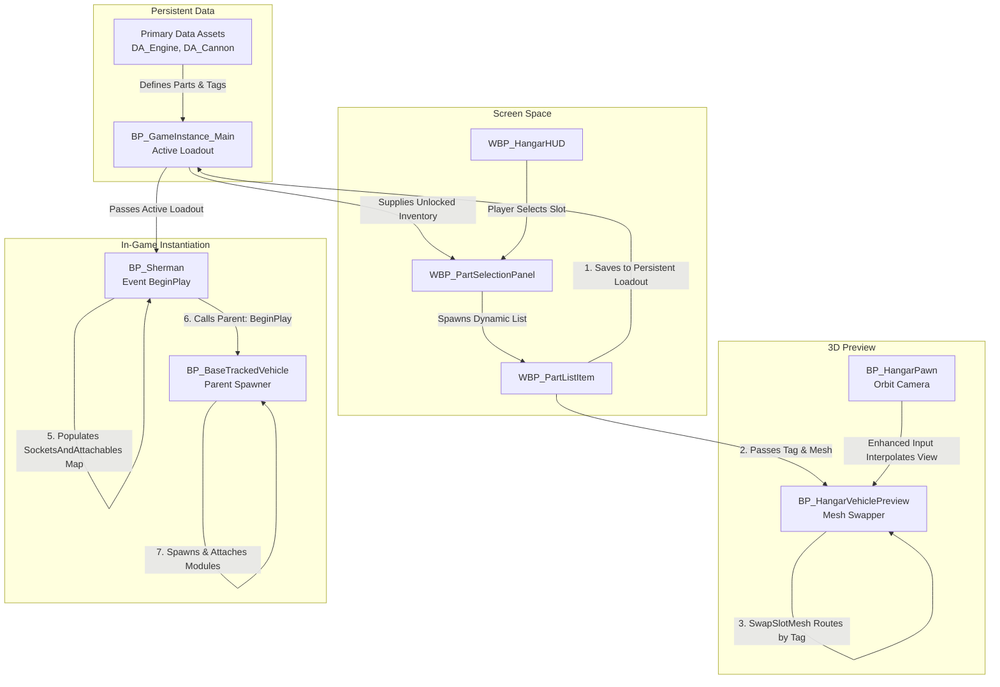

# Tank Commander: Systems & Tools Programming

**Tank Commander** is an Unreal Engine 5 vehicle combat game. As the **Systems & Tools Programmer**, I engineered the core data architecture, built the dynamic vehicle customization systems, and developed C++ utilities to optimize performance during heavy Chaos destruction events.

Here is a technical deep dive into the three core systems I built for this project.

---

## 1. Data-Driven Customization System (The Hangar)

I architected a robust, persistent 3D tank customization hangar. To ensure the system was scalable and designer-friendly, I utilized a strict separation of concerns, isolating the interactive UI, the visual 3D preview, and the persistent data state.

### Part Registration and Memory Optimization
* **Primary Data Asset (PDA) Workflow:** Designers author new tank parts (engines, suspensions, cannons) entirely through Data Assets (e.g., `DA_Engine`, `DA_Suspension`). Each part is identified by a hierarchical Gameplay Tag, meaning no code or Blueprint logic needs to be touched to expand the game's arsenal.
* **Persistent State & Lazy Loading:** Inside `BP_GameInstance_Main`, the `InitializeForVehicle` routine iterates through a vehicle's `AvailableParts`. It maintains an unlocked inventory by resolving Soft Object References and loading them into memory only when needed, minimizing the base memory footprint.
* **Runtime Instantiation (`BP_Sherman`):** To bring the hangar customizations into live gameplay, I intercepted the `EventBeginPlay` of the actual game pawn (`BP_Sherman`) to fetch the persistent `ActiveLoadout` from the GameInstance. Because the data assets use Soft Object References to prevent memory bloat, the tank's BeginPlay logic runs a `For Each Loop` over the slot assignments, synchronously resolves the references into `PDA_AttachableActor_C` classes, and populates a `SocketsAndAttachables` Map. Once fully mapped, it calls `Parent: BeginPlay` (`BP_BaseTrackedVehicle`) to trigger the physical spawning and attachment of the components.

### Decoupled UI & Preview Architecture
* **Dynamic Widget Population (`WBP_PartSelectionPanel`):** The customization UI is completely data-driven. When a player selects a vehicle slot (e.g., "Turret" or "Hull"), the panel iterates through the unlocked inventory and dynamically spawns `WBP_PartListItem` widgets. These list items bind to the underlying data asset properties to display stats and names, pushing updates back to the preview actor upon selection.
* **Tag-Based Mesh Routing (`SwapSlotMesh`):** The 3D preview actor (`BP_HangarVehiclePreview`) manages the physical representation. To prevent the UI from needing intimate knowledge of the actor's component hierarchy, I built a `SwapSlotMesh` function. It uses a **Switch on Gameplay Tag** node (matching tags like `Vehicle.Modules.Turret.Main` or `Vehicle.Modules.Hull.Base`) to securely route mesh updates to the correct target `StaticMeshComponent` (e.g., `SlotMesh_TurretMain`).

**Hangar Architecture & Data Flow:**


### Enhanced Input & Camera Interpolation
* **Framerate-Independent Orbit Camera (`BP_HangarPawn`):** To give the hangar a premium, tactile feel, I engineered a custom camera controller using Enhanced Input (`IA_HangarOrbit`, `IA_HangarZoom`). Instead of applying inputs directly to the camera's transform, inputs modify target variables (`TargetYaw`, `TargetPitch`, and `TargetZoom`).
* **Smooth Interpolation & Idle Panning:** On `Event Tick`, the current `OrbitYaw`, `OrbitPitch`, and `ZoomDistance` smoothly seek their targets using `FInterpTo`. `TargetPitch` is strictly clamped between -60° and 10°, while zoom is bounded between 200 and 1200 units. Furthermore, a `TimeSinceLastInput` tracker detects when the player stops interacting, seamlessly blending into an automated cinematic idle rotation.

*(Placeholder: Insert BlueprintUE.com iframe here showcasing the `SwapSlotMesh` logic from `BP_HangarVehiclePreview`)*

---

## 2. Chaos Destruction & C++ Performance Utilities

Unreal's Chaos Destruction engine provides incredible visuals, but generating thousands of physics-simulated debris pieces on ground contact severely impacts framerate and navmesh generation.

To solve this, I engineered a custom C++ component (`GeometryCollectionDebrisComponent`) that tracks fractured geometry. When debris hits the ground below a certain threshold, the component disables its physics proxy, visually hides the meshes by scaling their transform to zero, and replaces them with highly performant Niagara particle bursts.

```cpp
void UGeometryCollectionDebrisComponent::OnGCHit(
	UPrimitiveComponent* HitComponent,
	AActor* OtherActor,
	UPrimitiveComponent* OtherComp,
	FVector NormalImpulse,
	const FHitResult& Hit)
{
	auto* HitGC = Cast<UGeometryCollectionComponent>(HitComponent);
	if (!HitGC || !RegisteredGCComponents.Contains(HitGC)) return;

	// Filter out minor collisions
	if (NormalImpulse.SizeSquared() < ImpulseThreshold * ImpulseThreshold) return;

	const int32 ItemIndex = ResolveItemIndex(HitGC, Hit);
	if (ItemIndex < 0) return;
	
	/* ... [validation and timing logic omitted for brevity] ... */

	// 1. Disable physics for the piece and its descendants
	if (ValidIndices.Num() > 0 && Proxy)
	{
		Proxy->DisableParticles_External(MoveTemp(ValidIndices));
	}

	// 2. Hide visually by scaling transforms to zero
	TSet<int32>& Pending = PendingHideByGC.FindOrAdd(HitGC);
	for (int32 Idx : AllIndices)
	{
		Pending.Add(Idx);
	}
	HidePiecesVisually(HitGC, Pending);

	// 3. Spawn highly performant Niagara VFX in place of the geometry debris
	if (DebrisBurstSystem)
	{
		UNiagaraFunctionLibrary::SpawnSystemAtLocation(
			this, DebrisBurstSystem, Hit.ImpactPoint, NormalImpulse.GetSafeNormal().Rotation(),
			FVector(1.0f), true, true, ENCPoolMethod::AutoRelease
		);
	}
}
```

Alongside this, I built a modular destructible building template (`BP_ModularDestructible`) that utilizes **Cluster Union Actors** to structurally bind separate geometry components together, allowing buildings to shatter realistically while remaining easy to author.

---

## 3. In-Game Developer Tools & Cheat Console

Recognizing that rapid iteration is key to game design, I developed a suite of in-game tools to accelerate playtesting for the rest of the team.

* **Debug Pause Menu (`WBP_DebugPauseMenu`):** A custom runtime interface that allows developers to hot-swap graphic quality settings, invert keybinds, and mix audio sliders on the fly without having to restart the editor or dive into project settings.
* **Custom Cheat Console:** I integrated backend cheat commands offering toggles for infinite ammunition and a zero-delay rapid-fire cannon mode, allowing designers to quickly stress-test physics interactions and AI responsiveness.

*(Placeholder: Insert screenshot here showcasing the `WBP_DebugPauseMenu` interface)*
