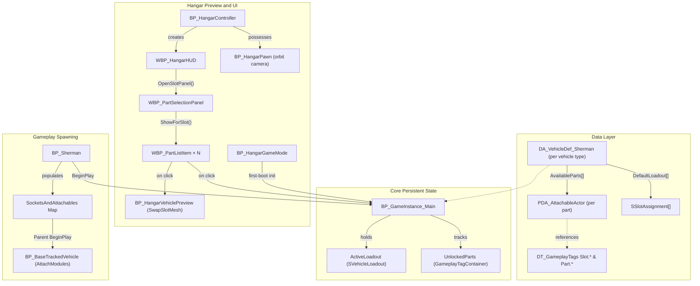

### Introduction

My main focus for this project was creating the **data-driven customization system** that allows designers to easily swap out tank parts, as well as optimizing the game's **performance** when dealing with heavy Chaos destruction.

I worked closely with the design team to ensure that the systems I built were modular, easy to extend, and didn't require any blueprint logic changes when adding new content.

### Modular Customization System (The Hangar)

The system is built on a simple idea: **Gameplay Tags are the universal key for everything.**

Every customization slot on a vehicle (turret, barrel, hull front, etc.) has a Gameplay Tag. Every attachable part also has a Gameplay Tag. When a player picks a part in the hangar UI, the system writes a `{SlotTag → PartTag}` mapping into a persistent struct on the GameInstance. When they deploy to gameplay, the tank reads that struct and spawns the correct meshes into the correct sockets.

Because everything is driven by tag lookups and data assets, you can add new parts or even new slots without touching blueprint logic — just create data assets and register them.

#### Hangar Interface & Preview

To provide a seamless customization experience, I built a dedicated Hangar GameMode. The player controls a `BP_HangarPawn` with custom orbit camera logic to smoothly rotate around the tank. 

When navigating the UI, clicking a part in the `WBP_PartSelectionPanel` triggers a `SwapSlotMesh` function on the `BP_HangarVehiclePreview` actor. This provides instant 3D visual feedback without affecting the actual gameplay actor. Once the player confirms their loadout, the final configuration is written to the GameInstance.

<div class="videos_two">
  
</div>

<iframe src="https://blueprintue.com/render/2qhgqz-2/" width="100%" height="400" scrolling="no" allowfullscreen></iframe>
<p class="video-text" style="font-size: 0.85rem; margin-top: 0.5rem;"><strong>ShowForSlot:</strong> Populates the UI grid with available parts matching the currently selected slot's GameplayTag.</p>

#### System Architecture


<p class="video-text" style="font-size: 0.85rem; margin-top: 0.5rem;"><strong>System Architecture:</strong> Data assets define available parts, the GameInstance stores the persistent configuration, and the Hangar UI safely previews them.</p>


### Chaos Destruction & Performance

Unreal's Chaos Destruction engine provides incredible visuals, but generating thousands of physics-simulated debris pieces on ground contact severely impacted our framerate.

To solve this, I engineered a **custom C++ component** (`GeometryCollectionDebrisComponent`) that tracks fractured geometry. When debris hits the ground below a certain impulse threshold, the component disables its physics proxy, visually hides the meshes, and replaces them with highly performant Niagara particle bursts.

<div class="videos_two">
  
</div>

```cpp
void UGeometryCollectionDebrisComponent::OnGCHit(
	UPrimitiveComponent* HitComponent, AActor* OtherActor, UPrimitiveComponent* OtherComp,
	FVector NormalImpulse, const FHitResult& Hit)
{
	auto* HitGC = Cast<UGeometryCollectionComponent>(HitComponent);
	if (!HitGC || !RegisteredGCComponents.Contains(HitGC)) return;

	if (NormalImpulse.SizeSquared() < ImpulseThreshold * ImpulseThreshold) return;

	// Disable physics for the piece and its descendants
	if (ValidIndices.Num() > 0 && Proxy) {
		Proxy->DisableParticles_External(MoveTemp(ValidIndices));
	}

	// Hide visually by scaling transforms to zero
	TSet<int32>& Pending = PendingHideByGC.FindOrAdd(HitGC);
	for (int32 Idx : AllIndices) Pending.Add(Idx);
	HidePiecesVisually(HitGC, Pending);

	// Spawn highly performant Niagara VFX in place of the geometry debris
	if (DebrisBurstSystem) {
		UNiagaraFunctionLibrary::SpawnSystemAtLocation(
			this, DebrisBurstSystem, Hit.ImpactPoint, NormalImpulse.GetSafeNormal().Rotation(),
			FVector(1.0f), true, true, ENCPoolMethod::AutoRelease
		);
	}
}
```
<p class="video-text" style="font-size: 0.85rem; margin-top: 0.5rem;"><strong>OnGCHit:</strong> Intercepts geometry debris impacts, disables their physics simulation, hides the meshes, and spawns performant Niagara particle bursts.</p>


### In-Game Developer Tools

Recognizing that rapid iteration is key to game design, I developed a suite of in-game tools to accelerate playtesting for the rest of the team. This included a custom Debug Pause Menu for hot-swapping graphic settings and keybinds, and a Cheat Console for testing physics and AI with infinite ammo and rapid-fire.

<div class="videos_two">
  
</div>

<iframe src="https://blueprintue.com/render/b_6a6e-f/" width="100%" height="400" scrolling="no" allowfullscreen></iframe>
<p class="video-text" style="font-size: 0.85rem; margin-top: 0.5rem;"><strong>ChangeScalabilitySettings:</strong> Routes an EScalabilityOptions enum through a switch to apply specific rendering quality configurations based on UI combobox selections.</p>

### What I learned

In this project, I learned a lot about architecting **data-driven systems** that empower designers. Creating a system that relies entirely on Data Assets and Gameplay Tags showed me the importance of separating content from logic.

I also gained valuable experience optimizing C++ code for Chaos destruction. Profiling and finding the exact bottleneck allowed me to create a targeted solution that drastically improved performance while maintaining visual fidelity.
