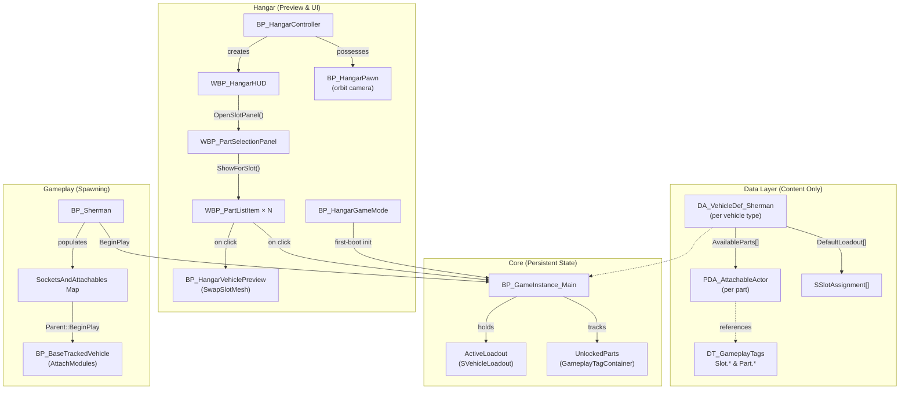

# Tank Commander: Systems & Tools Programming

**Tank Commander** is an Unreal Engine 5 vehicle combat game. As the **Systems & Tools Programmer**, I engineered the core data architecture, built the dynamic vehicle customization systems, and developed C++ utilities to optimize performance during heavy Chaos destruction events.

Here is a technical deep dive into the three core systems I built for this project.

---

## 1. Modular Vehicle Customization System (The Hangar)
**Developer Documentation & System Architecture Guide**

This section explains how the modular vehicle customization system works, how its pieces fit together, and how to extend it. It covers the data model, the hangar preview experience, the gameplay spawning pipeline, and all the configuration knobs you can tweak.

### How It Works (The Short Version)

The system is built on a simple idea: **Gameplay Tags are the universal key for everything.**

Every customization slot on a vehicle (turret, barrel, hull front, etc.) has a Gameplay Tag. Every attachable part also has a Gameplay Tag. When a player picks a part in the hangar UI, the system writes a `{SlotTag → PartTag}` mapping into a persistent struct on the GameInstance. When they deploy to gameplay, the tank reads that struct and spawns the correct meshes into the correct sockets.

Because everything is driven by tag lookups and data assets, you can add new parts or even new slots without touching blueprint logic — just create data assets and register them.

### System Architecture



### Data Model

#### Gameplay Tags (`DT_GameplayTags`)
Two tag hierarchies drive the system:

| Hierarchy | Example Tags | Purpose |
| :--- | :--- | :--- |
| **`Slot.*`** | `Slot.Turret.Main`, `Slot.Turret.Machinegun`, `Slot.Hull.Front` | Identifies a customization socket on the vehicle |
| **`Part.*`** | `Part.Sherman.Turret.T48`, `Part.Sherman.Barrel.M3` | Identifies a specific attachable module |

#### Part Data Asset (`PDA_AttachableActor`)
Each customizable part is a Primary Data Asset with these fields:

| Property | Type | Purpose |
| :--- | :--- | :--- |
| `PartTag` | GameplayTag | Unique identity for this part (used for unlock tracking) |
| `SlotTag` | GameplayTag | Which vehicle slot this part fits into |
| `DisplayName` | Text | Player-facing label in the UI |
| `PartDescription` | Text | Tooltip shown on hover in the selection panel |
| `AttachableActorConfiguration` | Soft Class/Mesh Ref | The mesh or actor class to spawn — loaded asynchronously |

#### Vehicle Definition (`DA_VehicleDefinition`)
Defines a complete vehicle type:

| Property | Type | Purpose |
| :--- | :--- | :--- |
| `AvailableParts` | Array of PDA references | All parts that exist for this vehicle |
| `DefaultLoadout` | Array of `SSlotAssignment` | The baseline {Slot → Part} assignments for new players |

#### Persistent Loadout (`SVehicleLoadout` struct on GameInstance)

| Property | Type | Purpose |
| :--- | :--- | :--- |
| `VehicleDefinition` | Object ref | Which vehicle type is active |
| `SlotAssignments` | Array of `SSlotAssignment` | Each entry is a `{SlotTag, EquippedPart}` pair |

### Blueprint Reference

#### BP_GameInstance_Main
> *Parent: GameInstance* — Persists across level transitions.

The central database. Stores what the player has equipped and what's unlocked.

| Function | What It Does |
| :--- | :--- |
| `InitializeForVehicle(VehicleDef)` | Stores the vehicle definition, calls `ResetToDefaults`, iterates all `AvailableParts` to auto-unlock base modules |
| `ResetToDefaults()` | Overwrites `ActiveLoadout.SlotAssignments` with the vehicle definition's `DefaultLoadout` |
| `SetSlotPart(SlotTag, PartRef)` | Finds the slot in the loadout array — updates it if found, appends if new — then commits |
| `GetLoadout()` | Pure getter — returns the `SVehicleLoadout` struct |
| `GetPartsForSlot(SlotTag)` | Filters `AvailableParts` by slot tag, resolves soft references, returns valid matches |
| `UnlockPart(PartTag)` | Appends tag to `UnlockedParts` GameplayTagContainer |
| `IsPartUnlocked(PartTag)` | Exact-match check against the `UnlockedParts` container |

#### BP_HangarPawn
> *Parent: Pawn* — The orbit camera controller in the hangar.

Handles all camera movement: click-drag orbiting, scroll-wheel zoom, smooth interpolation, and idle auto-rotation.

**Component Hierarchy:**
```
SceneRoot (SceneComponent)
 └─ CameraArm (SpringArmComponent)  — TargetArmLength: 600, TargetOffset Z: 100
     ├─ HangarCamera (CameraComponent) — FOV: 90
     └─ WidgetInteraction (WidgetInteractionComponent)
```

**Event Graph Structure (5 distinct blocks):**

| Event | Behavior |
| :--- | :--- |
| `BeginPlay` | Finds the `BP_HangarVehiclePreview`, teleports pawn to its location, sets initial camera arm rotation, caches PlayerController, registers `IMC_HangarControl` input mapping |
| `IA_HangarOrbitToggle` | Right-click hold: hides cursor + sets `bIsOrbiting = true`. Release: restores cursor + clears flag |
| `IA_HangarOrbit` | Mouse drag while orbiting: resets idle timer, scales X/Y delta into `TargetYaw`/`TargetPitch`, clamps pitch to [-60, +10] |
| `IA_HangarZoom` | Scroll wheel: resets idle timer, adjusts `TargetZoom` by `delta × 50`, clamps to [200, 1200], writes directly to arm length |
| `Tick` | Interpolates `OrbitYaw → TargetYaw`, `OrbitPitch → TargetPitch`, `ZoomDistance → TargetZoom` via `FInterpTo`. Applies rotation + arm length to SpringArm. Accumulates idle time; if idle > threshold and not orbiting, slowly increments `TargetYaw` |

#### BP_HangarVehiclePreview
> *Parent: Actor* — The 3D tank model displayed in the hangar.

A static display actor with named `StaticMeshComponent` slots attached to a `SkeletalMeshComponent` hull via sockets.

**Slot Components (attached to hull sockets):**

| Component Name | Socket | Default Mesh |
| :--- | :--- | :--- |
| `TurretMesh` | `Vehicle.Modules.Hull.Turret` | Sherman_Turret |
| `SlotMesh_TurretMain` | `Vehicle.Modules.Turret.Main` | Sherman_Cannon |
| `SlotMesh_TurretMachinegun` | `Vehicle.Modules.Turret.Machinegun` | Sherman_M2_Browning |
| `SlotMesh_TurretRoof` | `Vehicle.Modules.Turret.Roof` | Sherman_M2_Browning_Mount |
| `SlotMesh_TurretRoof_Weapon` | `Vehicle.Modules.Attachment` | Sherman_M2_Browning |
| `SlotMesh_TurretForefront` | `Vehicle.Modules.Turret.Forefront` | Sherman_MGCannon |
| `SlotMesh_HullFront` | `Vehicle.Modules.Hull.Front` | Sherman_MGCannon |
| `SlotMesh_HullRear` | `Vehicle.Modules.Hull.Rear` | *(empty)* |
| `SlotMesh_HullSides` | `Vehicle.Modules.Hull.Sides` | *(empty)* |

**Function: `SwapSlotMesh(SlotTag, NewMesh)`** — Runs a Switch on Gameplay Tag to route the mesh to the correct component above.

#### BP_Sherman
> *Parent: BP_BaseTrackedVehicle_Player* — The active gameplay vehicle.

On `BeginPlay`: casts to `BP_GameInstance_Main`, reads `ActiveLoadout`, loops through slot assignments, resolves soft class references, populates the inherited `SocketsAndAttachables` map, then calls `Parent::BeginPlay` which triggers `AttachModules` in the base class to spawn and socket all parts.

#### UI Widgets

**WBP_HangarHUD**
> Created by `BP_HangarController` on BeginPlay.

| Element | Behavior |
| :--- | :--- |
| Slot Buttons (Turret, Barrel, etc.) | Each calls `OpenSlotPanel(SlotTag, SlotName)` |
| `OpenSlotPanel()` | Queries `GetPartsForSlot` on GameInstance, passes results to `WBP_PartSelectionPanel`, makes panel visible |
| Deploy Button | Fades camera via PlayerCameraManager, then opens the gameplay level |
| `PreviewVehicleRef` | Reference to the preview actor, injected by the controller |

**WBP_PartSelectionPanel**

| Element | Behavior |
| :--- | :--- |
| `ShowForSlot(Parts[], SlotTag, SlotName)` | Sets header text, clears scroll box, creates a `WBP_PartListItem` per part, checks unlock status, tracks unlocked/total count, displays "{X} / {Y} unlocked" |
| `OnPartSelected` | Event Dispatcher — fires when a part is selected |
| `CurrentSlotTag` | Cached GameplayTag for the currently displayed slot |
| `PreviewVehicleRef` | Passed down to each list item for 3D preview swapping |

**WBP_PartListItem**

| Element | Behavior |
| :--- | :--- |
| `SetLockedState(IsLocked)` | Disables button + applies 0.4 alpha grey overlay when locked |
| On Hovered | Resolves `PartDA` (soft reference), reads `PartDescription`, displays in parent panel |
| On Unhovered | Clears description text |
| On Clicked | Calls `SwapSlotMesh` on preview actor + `SetSlotPart` on GameInstance |
| `PartDA` | **Soft Object Reference** to `PDA_AttachableActor` — loaded on-demand, not kept in memory |
| `OwnerPanel` | Back-reference to the `WBP_PartSelectionPanel` for description display |

#### Supporting Actors

| Blueprint | Role |
| :--- | :--- |
| `BP_HangarGameMode` | On BeginPlay, checks if GameInstance has a valid `SelectedVehicleDefinition`. If null (first boot), calls `InitializeForVehicle` with `DefaultVehicleDefinition` |
| `BP_HangarController` | On BeginPlay: sets input mode to Game+UI, shows cursor, creates `WBP_HangarHUD`, finds the preview actor, and injects it into the HUD |

### Workflows

#### Equipping a Part (Player Flow)
```
Click slot button → OpenSlotPanel(SlotTag)
    → GameInstance.GetPartsForSlot(SlotTag) → filtered PDA list
    → Panel.ShowForSlot() → creates list items
    → Player clicks item
        → Preview.SwapSlotMesh(SlotTag, Mesh)  ← instant visual
        → GameInstance.SetSlotPart(SlotTag, Part) ← persistent save
```

#### Deploying to Gameplay
```
Click Deploy → Camera fade → Open Level
    → BP_Sherman.BeginPlay
        → GameInstance.GetLoadout()
        → For each SlotAssignment: resolve soft ref → add to SocketsAndAttachables
        → Parent::BeginPlay → AttachModules() → parts spawn on sockets
```

### How to Extend the System

**Adding a New Part (No Code Changes)**
1. Add a tag in `DT_GameplayTags` under `Part.*` (e.g., `Part.Sherman.Turret.Experimental`)
2. Create a new `PDA_AttachableActor` data asset
3. Fill in `PartTag`, `SlotTag`, `DisplayName`, `PartDescription`, and assign the mesh
4. Add this data asset to `DA_VehicleDef_Sherman → AvailableParts`
5. Done — it automatically appears in the UI and can be equipped

**Adding a New Slot**
1. Add a `Slot.*` tag (e.g., `Slot.Turret.Antenna`)
2. Add a `StaticMeshComponent` to `BP_HangarVehiclePreview`, attached to the appropriate skeleton socket
3. Add a case for the new tag in `SwapSlotMesh`'s Switch on Gameplay Tag
4. Add a UI button in `WBP_HangarHUD` that calls `OpenSlotPanel` with the new tag
5. On the gameplay side, ensure the base vehicle mesh has the matching socket name

**Unlocking Parts at Runtime**
From any blueprint, cast to `BP_GameInstance_Main` and call `UnlockPart`:
```
Get Game Instance → Cast to BP_GameInstance_Main → UnlockPart(PartTag)
```

> [!IMPORTANT]
> Unlocks are currently stored only in the GameInstance memory and do **not** persist across game sessions. If you need save/load, you'll need to serialize the `UnlockedParts` GameplayTagContainer to a save game object.

### Configuration Variables

**BP_HangarPawn — Camera Tuning**

| Variable | Type | Default | What It Controls |
| :--- | :--- | :--- | :--- |
| `InterpSpeed` | Float | `8.0` | How fast the camera catches up to target rotation/zoom. Lower = sluggish cinematic feel, higher = snappy response |
| `IdleThreshold` | Float | `5.0` | Seconds of no input before auto-rotation kicks in |
| `IdleRotationSpeed` | Float | `2.5` | Degrees/sec added to yaw during idle. Negative = counter-clockwise |
| `TargetYaw` | Float | `0.0` | The yaw angle the camera is interpolating toward |
| `TargetPitch` | Float | `0.0` | The pitch angle the camera is interpolating toward |
| `TargetZoom` | Float | `600.0` | The arm length the camera is interpolating toward |
| `OrbitYaw` | Float | `0.0` | Current interpolated yaw (driven by Tick) |
| `OrbitPitch` | Float | `0.0` | Current interpolated pitch (driven by Tick) |
| `ZoomDistance` | Float | `0.0` | Current interpolated zoom distance (driven by Tick) |
| `bIsOrbiting` | Bool | `false` | Whether right-click drag is active |
| `TimeSinceLastInput` | Float | `0.0` | Accumulator for idle detection — resets on any input |

**Hard-coded clamps in the graph:**
- Pitch: **-60° to +10°** (prevents floor clipping and sky inversion)
- Zoom: **200 to 1200 units** (prevents camera inside the tank or too far away)
- Mouse sensitivity multiplier for orbit: **0.5** (pitch), **1.0** (yaw)
- Zoom step per scroll tick: **50 units**

**BP_HangarVehiclePreview — SpringArm Defaults**

| Property | Value | Note |
| :--- | :--- | :--- |
| `TargetArmLength` | `600` | Starting camera distance from the vehicle |
| `TargetOffset Z` | `100` | Vertical offset — camera looks slightly above center mass |

**UI Polish Values**

| Widget | Property | Value | Why |
| :--- | :--- | :--- | :--- |
| `WBP_PartSelectionPanel` | Description SizeBox Height | `120` | Fixed height prevents layout thrashing when hovering different items |
| `WBP_PartListItem` | Locked Alpha | `0.4` | Greyed-out opacity for locked parts |
| `WBP_PartListItem` | Button Enabled | `false` when locked | Prevents click events on locked items |

### Known Limitations & Gotchas

> [!WARNING]
> **Unlock persistence:** The `UnlockedParts` container lives only on the GameInstance. It resets when the game is closed. Implement a SaveGame serialization pass if you need persistence.

> [!NOTE]
> **Soft references everywhere:** Part data assets use soft references (`PartDA` on list items, `AvailableParts` on vehicle defs). This keeps memory usage low but means you must call `Resolve Soft Reference` or `Load Asset` before accessing the underlying object. The system already handles this in `GetPartsForSlot` and the list item hover logic.

> [!NOTE]
> **SwapSlotMesh is a Switch, not a Map:** Adding a new slot requires manually adding a case to the Switch on Gameplay Tag node in `BP_HangarVehiclePreview`. This is a conscious trade-off for simplicity — a map-based approach would be more scalable but harder to debug visually in Blueprints.

---

## 2. Chaos Destruction & C++ Performance Utilities

Unreal's Chaos Destruction engine provides incredible visuals, but generating thousands of physics-simulated debris pieces on ground contact severely impacts framerate and navmesh generation.

To solve this, I engineered a custom C++ component (`GeometryCollectionDebrisComponent`) that tracks fractured geometry. When debris hits the ground below a certain threshold, the component disables its physics proxy, visually hides the meshes by scaling their transform to zero, and replaces them with highly performant Niagara particle bursts.

```cpp
void UGeometryCollectionDebrisComponent::OnGCHit(
	UPrimitiveComponent* HitComponent,
	AActor* OtherActor,
	UPrimitiveComponent* OtherComp,
	FVector NormalImpulse,
	const FHitResult& Hit)
{
	auto* HitGC = Cast<UGeometryCollectionComponent>(HitComponent);
	if (!HitGC || !RegisteredGCComponents.Contains(HitGC)) return;

	// Filter out minor collisions
	if (NormalImpulse.SizeSquared() < ImpulseThreshold * ImpulseThreshold) return;

	const int32 ItemIndex = ResolveItemIndex(HitGC, Hit);
	if (ItemIndex < 0) return;
	
	/* ... [validation and timing logic omitted for brevity] ... */

	// 1. Disable physics for the piece and its descendants
	if (ValidIndices.Num() > 0 && Proxy)
	{
		Proxy->DisableParticles_External(MoveTemp(ValidIndices));
	}

	// 2. Hide visually by scaling transforms to zero
	TSet<int32>& Pending = PendingHideByGC.FindOrAdd(HitGC);
	for (int32 Idx : AllIndices)
	{
		Pending.Add(Idx);
	}
	HidePiecesVisually(HitGC, Pending);

	// 3. Spawn highly performant Niagara VFX in place of the geometry debris
	if (DebrisBurstSystem)
	{
		UNiagaraFunctionLibrary::SpawnSystemAtLocation(
			this, DebrisBurstSystem, Hit.ImpactPoint, NormalImpulse.GetSafeNormal().Rotation(),
			FVector(1.0f), true, true, ENCPoolMethod::AutoRelease
		);
	}
}
```

Alongside this, I built a modular destructible building template (`BP_ModularDestructible`) that utilizes **Cluster Union Actors** to structurally bind separate geometry components together, allowing buildings to shatter realistically while remaining easy to author.

---

## 3. In-Game Developer Tools & Cheat Console

Recognizing that rapid iteration is key to game design, I developed a suite of in-game tools to accelerate playtesting for the rest of the team.

* **Debug Pause Menu (`WBP_DebugPauseMenu`):** A custom runtime interface that allows developers to hot-swap graphic quality settings, invert keybinds, and mix audio sliders on the fly without having to restart the editor or dive into project settings.
* **Custom Cheat Console:** I integrated backend cheat commands offering toggles for infinite ammunition and a zero-delay rapid-fire cannon mode, allowing designers to quickly stress-test physics interactions and AI responsiveness.

*(Placeholder: Insert screenshot here showcasing the `WBP_DebugPauseMenu` interface)*
